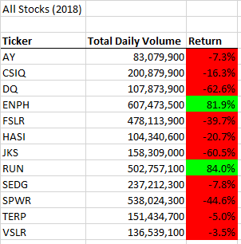
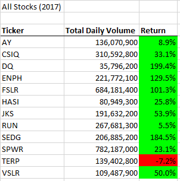
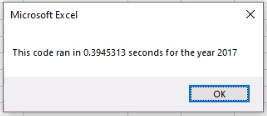
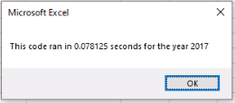
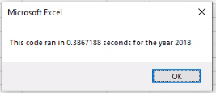
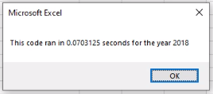

# **Stock Analysis**
Perform stock Analysis by using Excel Macro with Visual Basic language

## **Overview of Project**
The objective of this analysis is to analyze performance of multiple stocks on the market over the last few years by comparing *Total Daily Volume* and *Yearly Return* of each target stock in a particular year.

## **Results**
In 2018, only **ENPH** and **RUN** stocks had positive yearly returns, as well as large total daily volume. Both of them were significantly outperforming other stocks.

In 2017, all of stocks had positive return except **TERP** with (-7.2%). "DQ" had the best yearly return of 199.4%, with the lowest total daily Volume (35,796,200) in 2017.

## **Summary**

**Advantages of refactoring code in general**

There are a number of advantages that come from refactoring a code, primarily focusing on improving the design, structure and making it more efficient. Refactoring allows to fix any potential bugs and decrease the memory size of the code, resulting in a higher quality. 

**Disadvantages of refactoring code in general**

One major disadvantage of refactoring a code is that it could be damaged if not done properly, as well as potentially increase its size, lowering overall efficiency. 

**Advantages of the original and refactored VBA script**

The original VBA script allowed us to analyze the data for the total daily volume and yearly return for each stock. The main advantages of refactoring that VBA code was shorter data processing time and decreased memory size. Refer to the screenshots below to see the difference in the run time before and after refactoring of the code.

**Disadvantages of the original and refactored VBA script**

The main disadvantage in refactoring of the VBA code was the large amount of technical bugs that took a lot of time to figure out, in order to reach the desired result. 

**Original Code Run Time for 2017 vs. Refactored Code Run Time for 2017** 

**Original Code Run Time for 2018 vs. Refactored Code Run Time for 2018** 

